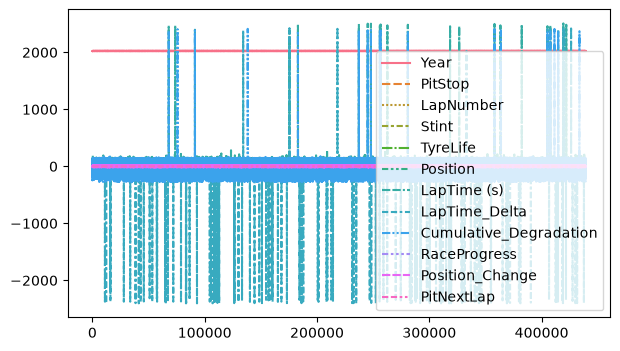
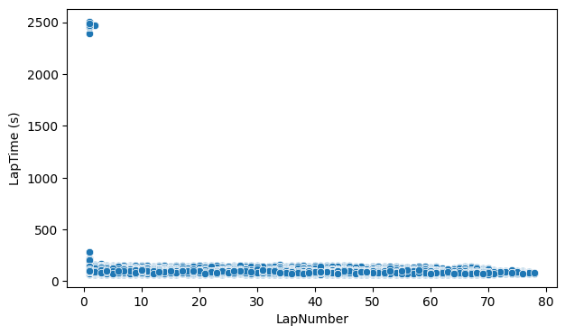
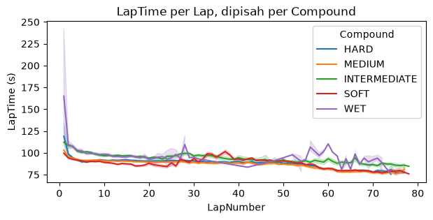
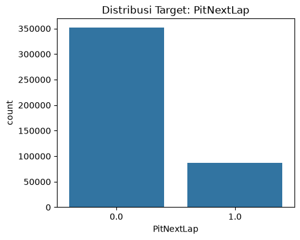
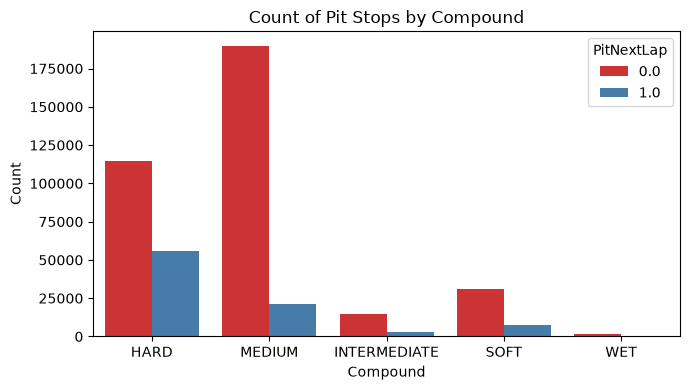

# 🏎️ Predicting F1 Pit Stops

**Machine Learning binary classification untuk memprediksi apakah seorang pembalap Formula 1 akan melakukan pit stop di lap berikutnya, berdasarkan data telemetry & race dari FastF1.**


---

## 🎯 Tentang Project

Repo ini berisi eksperimen data science untuk kompetisi Kaggle **"Predicting F1 Pit Stops"**, sebuah task binary classification di mana target `PitNextLap` menandakan apakah seorang driver akan masuk pit di lap selanjutnya (`1`) atau tidak (`0`).

Setiap baris data merepresentasikan kondisi satu driver pada satu lap tertentu — mencakup compound ban yang digunakan, posisi balapan, degradasi ban kumulatif, hingga perubahan posisi — dan tugasnya adalah menebak apakah keputusan pit stop akan diambil di lap berikutnya.

## 📂 Struktur Repository

```
predicting-f1-pitstops/
├── visualization.ipynb   # Exploratory Data Analysis (EDA) & visualisasi data
├── model-f1.ipynb        # Preprocessing, pipeline, dan training model
├── train.csv             # Data training (439,140 baris)
├── test.csv              # Data testing (188,165 baris)
├── submission.csv         # Hasil prediksi akhir (format submission Kaggle)
└── README.md
```

## 🗃️ Dataset

| Kolom | Deskripsi |
|---|---|
| `Driver` | Kode/identitas pembalap |
| `Compound` | Jenis ban yang digunakan (SOFT, MEDIUM, HARD, INTERMEDIATE, WET) |
| `Race` | Nama Grand Prix |
| `Year` | Tahun balapan |
| `PitStop` | Jumlah pit stop yang sudah dilakukan |
| `LapNumber` | Lap ke berapa |
| `Stint` | Stint balapan ke berapa |
| `TyreLife` | Usia ban (dalam lap) |
| `Position` | Posisi driver saat itu |
| `LapTime (s)` | Waktu lap dalam detik |
| `LapTime_Delta` | Selisih waktu lap dari lap sebelumnya |
| `Cumulative_Degradation` | Akumulasi degradasi performa ban |
| `RaceProgress` | Progres balapan (0–1) |
| `Position_Change` | Perubahan posisi |
| `PitNextLap` | 🎯 **Target** — apakah pit di lap berikutnya (0/1) |

Dataset ini cukup besar (>600 ribu baris gabungan train + test) dan **tidak memiliki missing value**, sehingga fokus utama ada di feature understanding, encoding kategori, dan penanganan imbalance pada target.

## 📊 Exploratory Data Analysis

Seluruh proses EDA didokumentasikan lengkap di [`visualization.ipynb`](./visualization.ipynb) menggunakan `seaborn` & `matplotlib`. Berikut ringkasan insight utamanya:

### 1. Gambaran Umum Seluruh Fitur Numerik


Line plot awal ini menampilkan seluruh kolom numerik sekaligus untuk melihat skala dan sebaran data secara kasar sebelum masuk ke analisis per fitur.

### 2. Hubungan LapTime vs LapNumber


Scatter plot ini menunjukkan bagaimana `LapTime (s)` bervariasi di sepanjang `LapNumber`. Terlihat sebaran waktu lap yang cukup konsisten dengan beberapa outlier — kemungkinan lap-lap dengan safety car, pit stop, atau kondisi cuaca ekstrem.

### 3. Degradasi LapTime per Jenis Compound


Dengan memecah `LapTime` berdasarkan `Compound`, terlihat pola degradasi performa ban yang berbeda-beda — beberapa compound cenderung lebih stabil, sementara yang lain menunjukkan penurunan performa yang lebih curam seiring bertambahnya usia ban. Insight ini penting karena `Compound` sangat relevan terhadap keputusan pit stop.

### 4. Distribusi Target: `PitNextLap`


Ini adalah temuan krusial: dataset **imbalanced**, dengan sekitar **80.1%** data berlabel `0` (tidak pit) dan hanya **19.9%** berlabel `1` (pit). Hal ini masuk akal karena pit stop adalah kejadian yang relatif jarang dibanding jumlah total lap balapan — dan menjadi alasan utama kenapa `scale_pos_weight` digunakan saat training model.

### 5. Distribusi Pit Stop per Jenis Compound


Count plot ini membandingkan proporsi pit vs tidak-pit di tiap jenis compound. Ban **HARD** dan **SOFT** menunjukkan proporsi pit yang relatif lebih tinggi dibanding **MEDIUM**, mengonfirmasi bahwa jenis compound berkorelasi kuat dengan keputusan strategi pit stop tim.

## ⚙️ Preprocessing & Feature Engineering

Proses ini didokumentasikan di [`model-f1.ipynb`](./model-f1.ipynb):

- **Cardinality check** — kolom kategorikal dicek jumlah nilai uniknya: `Compound` (5), `Race` (26), `Driver` (875)
- **Drop kolom `Driver`** karena cardinality-nya terlalu tinggi dan berisiko overfitting
- **Ordinal Encoding** untuk `Compound` dengan urutan logis: `INTERMEDIATE → HARD → MEDIUM → SOFT → WET`
- **One-Hot Encoding** untuk `Race`
- Seluruh langkah digabung menjadi satu `Pipeline` dengan `ColumnTransformer` dari scikit-learn agar preprocessing konsisten antara data train dan test

## 🤖 Modeling

Model akhir yang digunakan adalah **`XGBClassifier`**, dipilih karena performanya yang kuat untuk data tabular dan kemampuannya menangani class imbalance secara langsung lewat parameter `scale_pos_weight`.

```python
imbalance_ratio = total_zero / total_one  # ≈ 4.02

my_model = XGBClassifier(
    n_estimators=200,
    scale_pos_weight=imbalance_ratio,
    max_depth=5,
    learning_rate=0.05
)
```

Beberapa poin penting dari proses modeling:
- 🔀 Data displit menggunakan `train_test_split` (80/20) untuk evaluasi awal
- ⚖️ Imbalance ratio (~4:1) dihitung dan dimasukkan ke `scale_pos_weight` agar model tidak bias ke kelas mayoritas
- 🧪 `RandomForestClassifier` sempat dieksplorasi sebagai baseline sebelum beralih ke XGBoost untuk hasil yang lebih optimal
- 📦 Prediksi akhir terhadap `test.csv` diekspor ke `submission.csv` sesuai format kompetisi Kaggle

## 🚀 Cara Menjalankan

```bash
# Clone repo ini
git clone https://github.com/Arroyan23/predicting-f1-pitstops.git
cd predicting-f1-pitstops

# Install dependencies
pip install pandas scikit-learn xgboost seaborn matplotlib

# Jalankan notebook EDA
jupyter notebook visualization.ipynb

# Jalankan notebook modeling
jupyter notebook model-f1.ipynb
```

## 🛠️ Tech Stack

- **Python 3.11+**
- **Pandas** — data wrangling
- **Seaborn & Matplotlib** — visualisasi data
- **Scikit-learn** — preprocessing pipeline & evaluasi
- **XGBoost** — model klasifikasi utama

## 👤 Author

**Arroyan23**
Electrical Engineering Student | ML & Data Enthusiast

---

⭐️ Kalau project ini membantu atau menarik buat kamu, jangan lupa kasih star ya!
